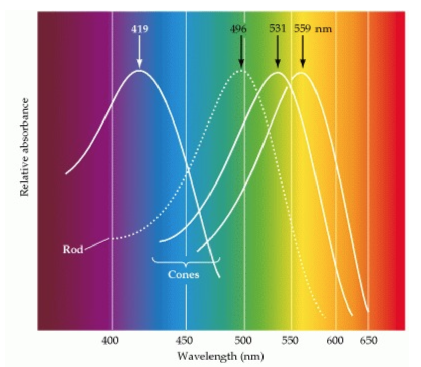
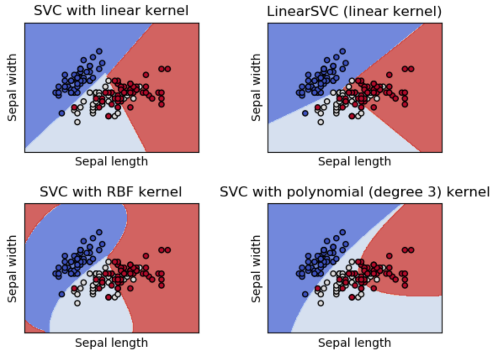

# This is where my title is missing

| Brandon Fisher, Ryan Danehy
| bfisch9@iu.edu, rdanehy@iu.edu
| Indiana University Bloomington
| hid: hid: sp19-222-89 sp19-222-102
| github: [:cloud:](https://github.com/cloudmesh-community/sp19-222-89/tree/master/project-report/report.md)
| code: [:cloud:](https://github.com/cloudmesh-community/sp19-222-89/tree/master/project-code)

---

Keywords: S-cones, Scikit, Support Vect Machine, Neural Network, WebPlotViz, ISOS (Inner Segment - Outer Segment junction), Cone Outer segment tip (COST).

---

## Abstract

We worked in partnership with Dr. Don Miller's lab from the IU School of Optometry, and the goal was to create a binary classifier which is trained to differentiate (and generate a count of) S-cones from L and M cones in 3D retinal imaging. We deployed an RBF-kernel SVM to classify S-cones vs non-S-cones. This project has clinical significance in the tracking of progression of the disease Retinitis Pigmentosa (RP). In RP, S-cones can be seen migrating from their natural positions, and eventually disappearing entirely in retinal scans. Our service could be extended from purely classifying/counting S-cones to tracking the rate of their movement and determining the progression/severity of the disease in a given patient.

## Introduction

Datasets were provided by Dr. Miller's lab which included the 3D coordinates and aperture size of each cone detected within the retinal scan. Using this information, we were able to differentiate the S-cones from the others due to their deeper position and wider aperture compared to the other cell types. Our starting dataset includes information from the images of 3 patients' retinas, and were be divided into sub-regions to give us more subsets. Additional data were collected/requested as needed.

After the initial model is trained, unlabeled data can be given for classification via rest service, and the count of S-cones will be returned via another rest service. Our service also allows the retraining of the model on new datasets, and then outputs the corresponding metrics on the newly trained model. This will allow our algorithms to be updated and improved upon as more data becomes available. 

## Basic Science
Cones or Cone cells are photorecptor cells in the retinas of humans. They are responsible for color vison and work best in bright lights. S-cone cells differ from M-cones, and L-cones based on the light wavelengths they are senstive to. For example S-cones are sensitive to short-wavelengths, M-cones to medium-wavelengths, and L-cones to Long-wavelengths (source 1). Short-wavelengths correspond with 'blue', medium with 'green', and long with 'red'. Therefore it is believed that the study of these cones could lead to new insights into dieseases such as red-green colorblindness.

{#fig:Color_Vision}

Caption: Color vision. The absorption spectra of the four photopigments in the normal human retina. The solid curves indicate the three kinds of cone opsins; the dashed curve shows rod rhodopsin for comparison. Absorbance is defined as the log value of the intensity of incident light divided by intensity of transmitted light (source 1).

Individual cones are entirely color blind in that their response is simply a reflection of the number of photons they capture, regardless of the wavelength of the photon. It is impossible, therefore, to determine why a change in the effectiveness of a particular cone occurred. This question can only be resolved by comparing the activity in different classes of cones. Comparisons of the responses of individual cone cells, and cells at higher levels in the visual pathway are clearly involved in how the visual system extracts color information from spectral stimuli. However, understanding of the neural mechanisms that underlie color perception has been elusive to the scientific community (source 2).

Figure:Cone_mosiac
caption:"This diagram was produced based on histological sections from a human eye to determine the density of the cones. The diagram represents an area of about 1° of visual angle. The number of S-cones was set to 7% based on estimates from previous studies. The L-cone:M-cone ratio was set to 1.5. This is a reasonable number considering that recent studies have shown wide ranges of cone ratios in people with normal color vision. In the central fovea an area of approximately 0.34° is S-cone free. The S-cones are semi-regularly distributed and the M- and L-cones are randomly distributed. Throughout the whole retina the ratio of L- and M- cones to S-cones is about 100:1(source 3)." 

There are two main reflection sites inside the cone photoreceptor cells that line the back of the eye. The first one occurs at what is called the inner segment – outer segment junction (ISOS) and the second one (which occurs directly behind the first one) occurs at what is called the cone outer segment tip (COST). Cones can be classfied by the comparison of the inner segment length vs outer segment length. For example histologically S-cones have a longer inner segment and a shorter outer segment. 

The ultimate goal of this project was to design an effective and fast method of classification of S-cones ultizing Machine Learning and REST Services. 

## Data
The data we used was from 3 different undisclosed/anonymous patients. We were given data by Dr. Millers group and was provided no data that could jeopadize the patients anonymity nor were we given any personal data that could or would put a patient's privacy in concern. 

Our data includes 8 features: X-Coordinate, Y-Coordinate, ISOS_Z, ISOS_size_X, ISOS_size_x, COST_z, COST_X , and COST_y. These features were extracted from 3D imaging of the retinal hence the three dimensional parameter types. ISOS_z is the retinal depth location of ISOS and COST_z is the retinal depth location of COST. 

Our raw data had some observances that were unknown or missing certain datapoints. We preproccessed the data in order to exclude those unknown or incomplete observances. The preproccessing that we performed on the data can be seen in the read_data.py file.  

Machine learning models can be very sensitive to scaling and in order to prevent this we normalized the data. Normalization rescales the data to be in the range of 0 to 1. Thus eliminating any possible feature scaling within our data. We performed normalization on our data using Scikit learn's preprocessing.normalize() function. This function scales the input indivudally to unit norms(vector length). 

In order to guarantee the quality of our data before training a model, we standardized our data. Standardization transforms data to have a mean of zero and standard deviation of 1. Standardization was performed by using scikit learn's StandardScaler(). 
Both normlization and Standardization can be seen in the file dnn.py

We visualized our data using WebPlotViz which results can be seen using the following link. https://spidal-gw.dsc.soic.indiana.edu/dashboard 

From the WebPlotViz visualizations it can be noted that the data is not clearly seperated into clusters nor in a regular shape. It also imporant to notice how there is no clear distiniction on which features are weighted heaviler then others in classifying S-cone from M and L-cones. However, histological studies have shown that the biggest differentiation betwen the different cones types is the difference between ISOS_Z - COST_Z. This difference siginifes the physical length of an important component of the cone photoreceptors. In one of the visulizations we plotted X_coordinate vs Y-coordniate vs (COST_Z- ISOS_Z). In this plot it is not glarily obvious that (COST_Z- ISOS_Z) is the most imporant feature, but there does seem to be a slight correlation. The lack of an obviously dominant feature led us to the conclusion that for our model to train the best no weights should be applied.

## Model Discussion
In our final project we decided to use a neural network using scikit learn's MLPClassifier(). We had several reason for picking neural networks one being the fact that it is supervised learning. Supervised learning make sense for our project because we were given labels for every cell observed. Supervised also made sense given that our goal was to predict the type of cone for a given cell, and making predictions is usually the goal behind supervised learning algorithms. 

In our final project we decided to use a neural network using scikit learn's MLPClassifier(). We had several reasons for picking neural networks one being the fact that it is supervised learning. Supervised learning make sense for our project because we were given labels for every cell observed. Supervised also made sense given that our goal was to predict the type of cone for a given cell, and making predictions is usually the goal behind supervised learning algorithms.

We started to use a support vector machine algorithm (SVM) as our model of choice, but several problems became evident while trying to implement the SVM. We originally choose Scikit’s svm.SVC() algorithm, but after testing it became apparent the model was not accurate at all averaging an F1 score below .3.  We then experimented with altering the parameters of the algorithm. We found that changing the kernel to ‘RBF’ produced an F1 score of 1.0. This makes sense given that our data is grouped in a nonlinear way and ‘RBF’ are used for nonlinear solutions. 

In our final project we decided to use a neural network using scikit learn's MLPClassifier(). We had several reasons for picking neural networks one being the fact that it is supervised learning. Supervised learning make sense for our project because we were given labels for every cell observed. Supervised also made sense given that our goal was to predict the type of cone for a given cell, and making predictions is usually the goal behind supervised learning algorithms.

We started to use a support vector machine algorithm (SVM) as our model of choice, but several problems became evident while trying to implement the SVM. We originally choose Scikit’s svm.SVC() algorithm, but after testing it became apparent the model was not accurate at all averaging an F1 score below .3.  We then experimented with altering the parameters of the algorithm. We found that changing the kernel to ‘RBF’ produced an F1 score of 1.0. This makes sense given that our data is grouped in a nonlinear way and ‘RBF’ are used for nonlinear solutions. 

{#fig:RBF_Kernel}

However, an F1 score of 1.0 is a possible symptom of an over fitting problem. Over fitting is when an algorithm matches so perfectly to the training data that any new data that is beyond the scope of the algorithm would cause problems. Insert picture of overfiting. To determine whether there is overfitting or not we decided to decrease the amount of data used for training. Decreasing the amount of data used for training should only slightly decrease the performance of the model unless there is overfitting. If there was overfitting then they would be a drastic difference since they would be less data to fit perfectly too. We trained with roughly 60% of the data rather then 80%. The new model that was trained with 60% of the data performed horribly confirming the overfitting problem. Thus we decided to move on to the implementation of a neural network.

## Sources
1.) Gouras, Peter. “The Role of S-Cones in Human Vision.” Documenta 	Ophthalmologica. Advances in Ophthalmology, U.S. National Library          of Medicine, Jan. 2003, www.ncbi.nlm.nih.gov/pubmed/12675479.

2.) Purves, Dale. “Cones and Color Vision.” Neuroscience. 2nd Edition., U.S. National Library of Medicine, 1 Jan. 1970,                          www.ncbi.nlm.nih.gov/books/NBK11059/.

3.) Rods and Cones.” Center for Imaging Science, Rochester Institute of Technology ,                                                            www.cis.rit.edu/people/faculty/montag/vandplite/pages/chap_9/ch9p1.html.
